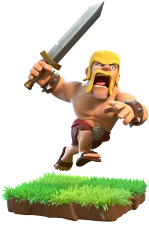
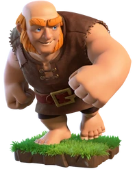
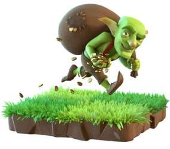
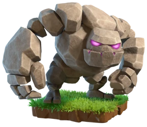
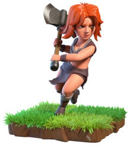
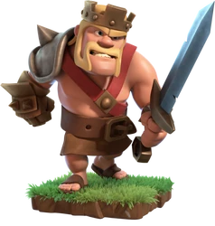
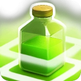
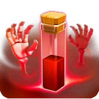
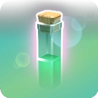

# 🏰 pranav - Clash of Clans Stats

---

## 📊 **Player Stats**

<table>
<tr>
<td><b>🏆 Trophies</b></td><td>1,870</td>
<td><b>🥇 Best</b></td><td>1,943</td>
</tr>
<tr>
<td><b>⭐ War Stars</b></td><td>118</td>
<td><b>⚔️ Attack Wins</b></td><td>9</td>
</tr>
<tr>
<td><b>🛡️ Defense Wins</b></td><td>2</td>
<td><b>🏗️ Builder Hall</b></td><td>10</td>
</tr>
<tr>
<td><b>🏛️ Clan Capital</b></td><td>45,368</td>
<td><b>🥽 League</b></td><td>Gold League I</td>
</tr>
</table>

## 🏰 **Clan Info**

<table>
<tr>
<td><b>🦅 Name</b></td><td>Hawks</td>
<td><b>📊 Level</b></td><td>7</td>
<td><b>👤 Role</b></td><td>Member</td>
</tr>
</table>

## ⚔️ **Top Troops** (Lv 5+)

<table>
<tr>
<td><b> Barbarian</b> 8/12</td>
<td><b> Archer</b> 8/13</td>
<td><b> Giant</b> 8/13</td>
</tr>
<tr>
<td><b> Wizard</b> 8/13</td>
<td><b> Goblin</b> 7/9</td>
<td><b> Wall Breaker</b> 7/13</td>
</tr>
<tr>
<td><b> Balloon</b> 7/12</td>
<td><b> P.E.K.K.A</b> 7/12</td>
<td><b> Hog Rider</b> 6/14</td>
</tr>
<tr>
<td><b> Golem</b> 6/14</td>
<td><b> Dragon</b> 5/12</td>
<td><b> Minion</b> 5/13</td>
</tr>
<tr>
<td><b> Valkyrie</b> 5/11</td>
<td></td>
<td></td>
</tr>
</table>

## 👑 **Heroes**

<table>
<tr>
<td align="center"><b> Archer Queen</b> 42/100</td>
<td align="center"><b> Barbarian King</b> 41/100</td>
<td align="center"><b> Minion Prince</b> 30/90</td>
<td align="center"><b> Grand Warden</b> 12/75</td>
</tr>
</table>

## 🪄 **Spells**

<table>
<tr>
<td><b> Lightning</b> 7/12</td>
<td><b> Healing</b> 7/11</td>
<td><b> Rage</b> 5/6</td>
<td><b> Poison</b> 4/11</td>
</tr>
<tr>
<td><b> Haste</b> 4/6</td>
<td><b> Earthquake</b> 3/5</td>
<td><b> Jump</b> 2/5</td>
<td><b> Freeze</b> 2/7</td>
</tr>
<tr>
<td><b> Clone</b> 2/8</td>
<td><b> Skeleton</b> 1/8</td>
<td><b> Bat</b> 1/7</td>
<td><b> Invisibility</b> 1/4</td>
</tr>
</table>

---

### 🔄 **Last Updated**: August 16, 2025 at 23:42 UTC

*📡 Auto-generated from the Clash of Clans API*

