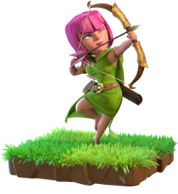
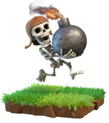
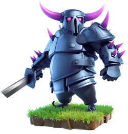
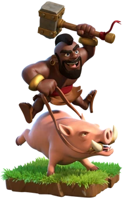
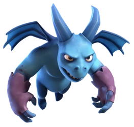
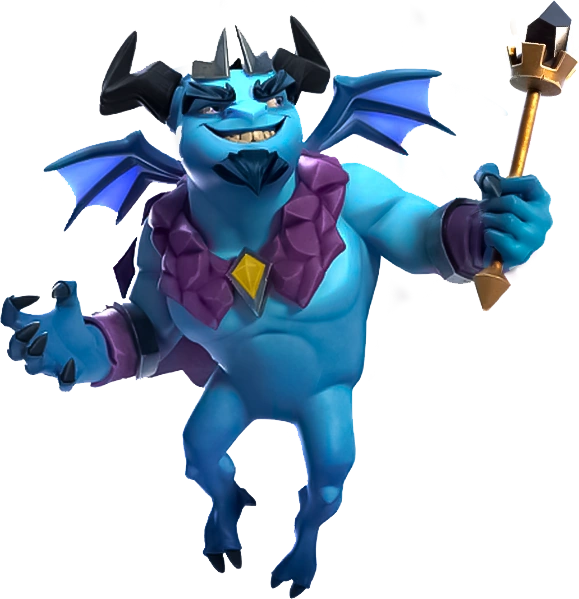
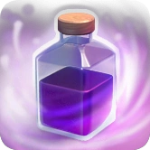
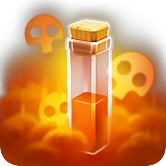
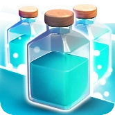

<div align="center">

# 🏰 pranav - Clash of Clans Profile


</div>

---

## 📊 **Player Overview**

<table>
<tr>
<td><b>🏆 Current Trophies</b></td><td>1,829</td>
<td><b>🥇 Best Trophies</b></td><td>1,943</td>
</tr>
<tr>
<td><b>⭐ War Stars</b></td><td>118</td>
<td><b>⚔️ Attack Wins</b></td><td>0</td>
</tr>
<tr>
<td><b>🛡️ Defense Wins</b></td><td>0</td>
<td><b>🏗️ Builder Hall</b></td><td>10</td>
</tr>
<tr>
<td><b>🏛️ Clan Capital</b></td><td>45,368</td>
<td><b>🥽 League</b></td><td>Gold League I</td>
</tr>
</table>

## 🏰 **Clan Information**

<table>
<tr>
<td><b>🦅 Clan Name</b></td><td>Hawks</td>
<td><b>📊 Clan Level</b></td><td>7</td>
<td><b>👤 Your Role</b></td><td>Member</td>
</tr>
</table>

### 🏆 **War & Battle Statistics**

<table>
<tr>
<td><b>⚔️ Total Attack Wins</b></td><td>0</td>
<td><b>🛡️ Total Defense Wins</b></td><td>0</td>
</tr>
<tr>
<td><b>⭐ War Stars Earned</b></td><td>118</td>
<td><b>🏛️ Clan Capital Contributions</b></td><td>45,368</td>
</tr>
</table>

## 📈 **Progress Overview**

<table>
<tr>
<td><b>⚔️ Troops Progress</b></td><td>0/38 Maxed</td><td><b>📊</b></td><td>0.0%</td>
</tr>
<tr>
<td><b>👑 Heroes Progress</b></td><td>0/4 Maxed</td><td><b>📊</b></td><td>0.0%</td>
</tr>
<tr>
<td><b>🪄 Spells Progress</b></td><td>0/12 Maxed</td><td><b>📊</b></td><td>0.0%</td>
</tr>
</table>

### 🎯 **Progress Visualization**

<div align="center">

#### ⚔️ **Troops Progress**
```
░░░░░░░░░░░░░░░░░░░░ 0.0%
```

#### 👑 **Heroes Progress**
```
░░░░░░░░░░░░░░░░░░░░ 0.0%
```

#### 🪄 **Spells Progress**
```
░░░░░░░░░░░░░░░░░░░░ 0.0%
```

</div>

## ⚔️ **Top Troops** (Level 5+)

<table>
<tr>
<td><b> Barbarian</b><br>8/12<br><code>████░░</code></td>
<td><b> Archer</b><br>8/13<br><code>████░░</code></td>
<td><b> Giant</b><br>8/13<br><code>████░░</code></td>
</tr>
<tr>
<td><b> Wizard</b><br>8/13<br><code>████░░</code></td>
<td><b> Goblin</b><br>7/9<br><code>███░</code></td>
<td><b> Wall Breaker</b><br>7/13<br><code>███░░░</code></td>
</tr>
<tr>
<td><b> Balloon</b><br>7/12<br><code>███░░</code></td>
<td><b> P.E.K.K.A</b><br>7/12<br><code>███░░</code></td>
<td><b> Hog Rider</b><br>7/14<br><code>███░░░</code></td>
</tr>
<tr>
<td><b> Golem</b><br>6/14<br><code>███░░░░</code></td>
<td><b> Dragon</b><br>5/12<br><code>██░░░</code></td>
<td><b> Minion</b><br>5/13<br><code>██░░░░</code></td>
</tr>
<tr>
<td><b> Valkyrie</b><br>5/11<br><code>██░░░</code></td>
<td></td>
<td></td>
</tr>
</table>

## 👑 **Heroes Progress**

<table>
<tr>
<td align="center"><b><br>Barbarian King</b><br>43/100<br><code>█████████████████████░░░░░░░░░░░░░░░░░░░░░░░░░░░░</code></td>
<td align="center"><b><br>Archer Queen</b><br>43/100<br><code>█████████████████████░░░░░░░░░░░░░░░░░░░░░░░░░░░░</code></td>
<td align="center"><b><br>Minion Prince</b><br>30/90<br><code>███████████████░░░░░░░░░░░░░░░░░░░░░░░░░░░░░░</code></td>
<td align="center"><b><br>Grand Warden</b><br>12/75<br><code>██████░░░░░░░░░░░░░░░░░░░░░░░░░░░░░░░</code></td>
</tr>
</table>

## 🪄 **Spells Progress**

<table>
<tr>
<td><b> Lightning</b><br>7/12<br><code>███░░</code></td>
<td><b> Healing</b><br>7/11<br><code>███░░</code></td>
<td><b> Rage</b><br>5/6<br><code>██</code></td>
<td><b> Poison</b><br>4/11<br><code>██░░░</code></td>
</tr>
<tr>
<td><b> Haste</b><br>4/6<br><code>██░</code></td>
<td><b> Earthquake</b><br>3/5<br><code>█░</code></td>
<td><b> Jump</b><br>2/5<br><code>█░</code></td>
<td><b> Freeze</b><br>2/7<br><code>█░░</code></td>
</tr>
<tr>
<td><b> Clone</b><br>2/8<br><code>█░░░</code></td>
<td><b> Skeleton</b><br>1/8<br><code>░░░</code></td>
<td><b> Bat</b><br>1/7<br><code>░░░</code></td>
<td><b> Invisibility</b><br>1/4<br><code>░</code></td>
</tr>
</table>

## 🏆 **Top Achievements**

<table>
<tr><td><b>🏅 Bigger Coffers</b></td><td>3⭐</td><td>12/10</td></tr>
<tr><td><b>🏅 Bigger & Better</b></td><td>3⭐</td><td>11/8</td></tr>
<tr><td><b>🏅 Nice and Tidy</b></td><td>3⭐</td><td>3,198/500</td></tr>
<tr><td><b>🏅 Discover New Troops</b></td><td>3⭐</td><td>1/1</td></tr>
<tr><td><b>🏅 Gold Grab</b></td><td>3⭐</td><td>165,089,578/100,000,000</td></tr>
</table>

## 🏷️ **Player Labels**

<div align="center">


</div>

## 🎯 **Seasonal Challenges & Events**

<div align="center">

### 🏆 **Current Season Status**


</div>

## 📊 **Detailed Statistics**

<details>
<summary><b>🔍 Click to view detailed stats</b></summary>

### 🏠 **Home Village Stats**
- **Town Hall Level**: {townHallLevel}
- **Experience Level**: {expLevel}
- **Current Trophies**: {trophies:,}
- **Best Trophies**: {bestTrophies:,}
- **War Stars**: {warStars}
- **Attack Wins**: {attackWins:,}
- **Defense Wins**: {defenseWins:,}

### 🏗️ **Builder Base Stats**
- **Builder Hall Level**: {builderHallLevel}
- **Builder Base Trophies**: {builderBaseTrophies:,}

### 🏛️ **Clan Stats**
- **Clan Name**: {clan}
- **Clan Level**: {clanLevel}
- **Your Role**: {role}
- **Clan Capital Contributions**: {clanCapitalContributions:,}

### 📈 **Progress Metrics**
- **Troops**: {maxedTroops}/{totalTroops} maxed ({troop_progress:.1f}%)
- **Heroes**: {maxedHeroes}/{totalHeroes} maxed ({hero_progress:.1f}%)
- **Spells**: {maxedSpells}/{totalSpells} maxed ({spell_progress:.1f}%)

### 🎮 **Game Activity**
- **Total Troops**: {totalTroops}
- **Total Heroes**: {totalHeroes}
- **Total Spells**: {totalSpells}
- **Achievement Stars**: {sum([a.get('stars', 0) for a in achievements])}

</details>

---

<div align="center">

### 🔄 **Last Updated**: {datetime.now().strftime('%B %d, %Y at %H:%M UTC')}


---

### 📊 **Profile Statistics**


*📡 Auto-generated from the Clash of Clans API*

</div>